# Liminal Flow

<p align="center">
  
</p>

A terminal-native working-memory sidecar. Track what you're working on, branch your attention across sub-tasks, and maintain ambient context awareness — all from the terminal.

## Quick Start

```bash
# Build from source
cargo build --release

# The binary is `flo`
./target/release/flo              # Launch TUI
./target/release/flo now "improving AIDX"   # Set current thread
./target/release/flo branch "debugging auth"  # Branch off
./target/release/flo where        # Show current state
./target/release/flo resume       # Resume recent work
./target/release/flo back         # Return to parent
./target/release/flo park         # Park the active branch
./target/release/flo done         # Mark the active focus done
./target/release/flo archive      # Archive the active focus
```

## Installation

### From GitHub Releases

Flow releases publish Linux artefacts for:

- `x86_64-unknown-linux-gnu` (`amd64`)
- `aarch64-unknown-linux-gnu` (`arm64`)

Each Linux release publishes:

- a standalone `flo` binary
- a prefix-friendly `.tar.gz` archive containing `bin/flo` and generated man pages under `share/man/man1/`
- `.deb` and `.rpm` packages
- `.sha256` checksum files for every artefact

### GNU/Linux compatibility

Release binaries and Linux packages are expected to work on:

- Ubuntu `22.04+`
- common WSL2 Ubuntu environments based on Ubuntu `22.04+`
- Debian `12+`
- Fedora `40+`

Older GNU/Linux systems are not supported by these release artefacts, including:

- Debian `11`
- RHEL `9`

### Linux package installs

Install paths for Linux packages:

- binary: `/usr/bin/flo`
- man pages: `/usr/share/man/man1/`

Example package installs:

```bash
# Debian/Ubuntu
sudo dpkg -i flo-v0.0.3-linux-x64.deb

# Fedora/RHEL/openSUSE
sudo rpm -i flo-v0.0.3-linux-x64.rpm
```

### Manual archive installs

Release tarballs unpack into a prefix-friendly layout:

```text
bin/flo
share/man/man1/flo.1.gz
share/man/man1/flo-*.1.gz
```

Example manual install into `/usr/local`:

```bash
tar -xzf flo-v0.0.3-linux-x64.tar.gz
sudo install -Dm755 bin/flo /usr/local/bin/flo
sudo install -Dm644 share/man/man1/flo.1.gz /usr/local/share/man/man1/flo.1.gz
sudo install -d /usr/local/share/man/man1
sudo cp share/man/man1/flo-*.1.gz /usr/local/share/man/man1/
```

## What It Does

Liminal Flow keeps track of your working context so you don't have to. When you switch between tasks, branch into sub-problems, or need to remember what you were doing — `flo` has your back.

**Threads** are your main units of work. Only one is active at a time.

**Branches** let you track tangential sub-tasks without losing your place.

**Scopes** automatically capture your git repo, branch, and working directory.

**Events** log every state change, so the TUI can detect CLI changes in real time.

## CLI Commands

| Command | Description |
|---|---|
| `flo` | Launch the TUI |
| `flo now <text>` | Set or replace the current thread |
| `flo branch <text>` | Create a branch beneath the current thread |
| `flo back` | Return to the parent thread |
| `flo park` | Park the active branch |
| `flo note <text>` | Attach a note to the current focus target |
| `flo where` | Print current thread and branches |
| `flo resume` | Resume the most recent paused, done, or parked work |
| `flo pause` | Pause the current thread |
| `flo done` | Mark the active branch done, or finish the thread and its branches |
| `flo archive` | Archive the active thread or branch |
| `flo list` | List active, paused, and done threads |

## TUI

Run `flo` with no arguments to launch the terminal UI:

```
┌────────────────────────────────────────────────────────────┐
│ Liminal Flow                                    <flo>      │
├──────────────────┬─────────────────────────────────────────┤
│ Threads          │ Status                                  │
│ > ▼ improving    │ Branch: debugging auth                  │
│     debugging    │ Thread: improving AIDX                  │
│   ▶ wear os sync │ Repo: component-library                 │
│                  │ Git: feature/aidx                        │
│                  │                                          │
│                  │ Notes                                    │
│                  │   need to check the auth token flow      │
│                  │   waiting on API response                │
├──────────────────┴─────────────────────────────────────────┤
│ > Capture (branch: debugging auth)                         │
└────────────────────────────────────────────────────────────┘
```

The TUI starts in **Insert mode**:

- Type slash commands (`/now`, `/branch`, `/back`, `/park`, `/archive`, `/note`, `/where`, `/resume`, `/pause`, `/done`) or plain text (treated as a note)
- Lifecycle slash commands can carry trailing note text, for example `/park need more data first` or `/done shipped first pass`
- Unknown slash commands now error instead of silently being stored as notes
- Type `/` on an empty line to open the **command palette** — navigate with arrow keys, select with Enter
- Type `?` on an empty line to see **shortcut hints**
- **Up/Down** arrows navigate the thread list; the thread list auto-scrolls to keep selection visible; **Enter** on empty input expands/collapses branches
- Mouse-wheel scrolling follows the hovered pane: `Threads`, `Status`, and `Help` each scroll independently
- Left-click in the thread list selects the clicked thread or branch
- The **Status** pane follows the selected thread or branch for inspection
- The **Capture** pane shows the active plain-text note target explicitly
- Selected-item notes in the **Status** pane show compact timestamps and separators for readability
- Type `/resume`, `/pause`, `/park`, `/done`, `/archive`, or `/note <note>` in Insert mode to act on the currently selected item without switching to Normal mode
- Type plain text without a slash to add a note to the current active capture target
- Press `Esc` for **Normal mode** where `j`/`k` navigate, `Enter` expands or collapses the selected thread, `PageUp`/`PageDown` scroll the Status pane, `r` resumes a selected item to make it active again, `p` parks a selected branch, `d` marks the selected item done, `?` opens help, `a` shows about, and `q` quits
- Press `Shift+A` in Normal mode to archive the selected item and remove it from the main working list
- Done threads and branches stay visible as tombstones until they are archived, so you can still inspect and revive them with `r`
- In the **Help** overlay, `j`/`k`/Up/Down and `PageUp`/`PageDown` scroll the help content on smaller terminals

The TUI polls the database every 250ms, so changes made via `flo` CLI in another terminal appear automatically.

## Architecture

Liminal Flow is a Rust workspace with five crates:

| Crate | Purpose |
|---|---|
| `liminal-flow-core` | Domain model, events, reducer, deterministic rules |
| `liminal-flow-store` | SQLite persistence, migrations, repositories |
| `liminal-flow-cli` | CLI entrypoint and command handlers |
| `liminal-flow-tui` | Terminal UI (ratatui + crossterm) |
| `liminal-flow-context` | Git and workspace context discovery |

### Key Design Decisions

- **Single binary**: `flo` with no args → TUI, subcommands → headless CLI
- **Local-first**: All data in SQLite with WAL mode for concurrent CLI + TUI access
- **Events table**: Append-only audit log enables TUI polling via watermark
- **Pure reducer**: State transitions are deterministic and tested
- **No forced background**: TUI uses the terminal's default background colour

## Building

```bash
cargo build                           # debug build
cargo build --release                 # release build
cargo test                            # run all tests
cargo clippy --workspace -- -D warnings  # lint
cargo fmt --check                     # check formatting
```

## Configuration

Config lives at the platform-appropriate config directory (e.g., `~/.config/liminal-flow/config.toml` on Linux):

```toml
[ui]
show_scopes = true
show_hints = false
compact_mode = false

[context]
git_enrichment = true

[logging]
level = "info"
```

## Persistence

SQLite database at the platform data directory (e.g., `~/.local/share/liminal-flow/liminal-flow.db` on Linux). WAL mode is enabled for safe concurrent access.

## Uninstall

- Debian/Ubuntu: `sudo dpkg -r flo`
- RPM-based systems: `sudo rpm -e flo`
- Manual installs: remove `flo` and the installed man pages from the same prefix

## Licence

MIT — see [LICENSE](LICENSE).

Copyright 2026 Liminal HQ, Scott Morris.
